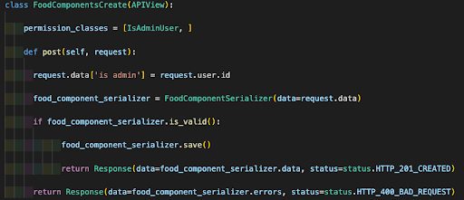
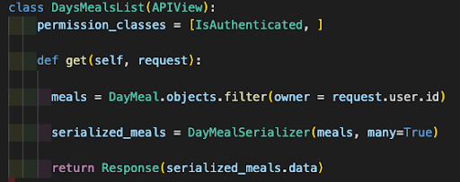
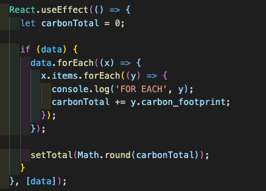
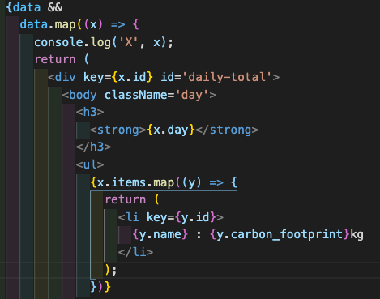

## Project Overview

ECOMO, a portmanteau of 'eco' and the spanish verb meaning 'I eat', is a website where users can input their daily food intake and monitor their carbon footprint attached to their dietary choices. The data for the carbon prices and users' meals is stored in a Django database while carbon calculations are done on frontend using JavaScript.

[Visit Site Here](https://ecomo-food-tracker.netlify.app/)

### Brief

<li>Solo Project</li>
<li>8 day time frame</li>
<li>Build a relational database with Django</li>
<li>Have a 'one to many' relationship</li>
<li>Have a 'many to many' relationship</li>
<li>Connect it to a frontend built with React</li>
<li>Deploy the backend on Heroku</li>
<li>Deploy the frontend on Netlify</li>

### Technologies used

HTML5, SCSS, JavaScript (ES6), React and React extensions, Webpack, NPM, Babel, Postman, Python 3, Django, Heroku, Netlify, Git, GitHub, Excalidraw

### The Process

#### Day 1

I'd come up with an idea that I was excited to build, in the Food Carbon Tracker Website. I made some wireframes of the windows which would be included in my website, however I was finding it difficult to conceptualise the relationships which would be necessary in an SQL database. Therefore I drew diagrams of the one to many and many to many relationships in Excalidraw.

#### Day 2

I got the basic backend started with Django and pushed it to a newly created GitHub repository and also deployed the project on Heroku. I did this to avoid a “big bang deployment” at the end of the project. I then completed my secure registration, login and ability for users to check their own credentials. I tested all of the endpoints using Postman, ensuring that the jwt tokens were functioning correctly.

#### Day 3

I continued to work on the backend and added the ability for users to upload their own meals. I did this by building the models and serializers for meal uploads from the user and also carbon data uploads for admin users (pictured below).

In the views.py file for these features I ensured that only the admin user could upload the carbon data and also only logged in users could post meals. Although progress was slow I felt I had gained a deeper understanding of the processes taking place on the backend.

#### Day 4

When doing more extensive testing of the database and API using Postman I realised I had an issue with the API call for getting meal data, which was returning all of the data from all of the users. I therefore also created an extra view that meant only the owner of a particular carbon footprint could access that data. This was a specific piece of logic I had to write as it was not included under Django's inbuilt 'Generic Views'. Once this had been built I was returning the correct data in Postman.

#### Days 5 & 6

Although I had worked through the console errors the previous night whilst trying to get my front and back end talking I still had an issue persisting into the next day. After having fresh eyes look at the project I realised that it was my error, and the reason I was receiving a 419 HTTP error was because I was trying to register an already existing user. Duh! I started building the form which users would use to input their meal data. The handlesubmit was buggy and took time to fix. When that was working I realised that the handlechange function on the dropdown also had a bug in which if a user erroneously selected a food it would store that as a string in the array of foods it was being pushed too. This could lead to duplicates of foods or excess items being pushed in. I therefore spent a long time writing logic to get around this issue.

#### Days 7 & 8

I worked on styling on the Sunday night of a busy weekend. I added a navbar which showed different things to normal users and logged in users as well as applying the logo and background images to pages. On the final day I completed the logic to add up the carbon totals for a user's meal and get it to display on a new page. As the data was very nested it was difficult to access and work with. I initially tried using a forEach loop and although from console logging, I felt I was getting close to what I needed, I hit a dead end. I therefore completely changed my plan and used data.maps to complete the functions. I then deployed my backend to Heroku and my frontend to Netlify as required.

### Bugs

There is a bug relating to how the results render when calculating the carbon footprint. If a user has many meals they will appear in one continuous list instead of in a grid as I had tried to code. Unfortunately I ran out of time to fix this although I know it’s something which needs addressing if I were to continue working on it.

### Wins

To build a fully functioning, fully secured backend was a massive win for me. Because it was my project from conception I was able to fully comprehend the different relationships involved in my relational database. As well as how the different components work together and how they work individually. Illustrated below is the code which means the currently logged in user can see only their own statistics. This is not a Generic View in Django and required me to use a filter.

### Challenges

A really difficult part of the client side app was the calculation of the carbon data. After trying to do so with a ForEach loop I could only return the total for all of the users input across many days (shown below) which was included as part of the finished product.

However, for the calculation of carbon for each meal or day that is inputted by the user I had to, in the end, map through the array to return the correct data (shown below).

### Future Features

Due to time constraints the amount of foods that can be input is limited, I don't think beef, butter and bread constitute a healthy diet for the users. Therefore I'd like to add more options. I also originally planned to be able to input portion sizes and calculate that too, however, I ran out of time.
I also initially planned to connect this to an existing API which contains an extensive list of carbon data for different foods, however I didn't hear back from the admin staff at this particular company in time. They have since contacted me, therefore I'd like to possibly incorporate this data in future. Lastly, I’d like to fix the bug which renders the user’s carbon footprint poorly.
