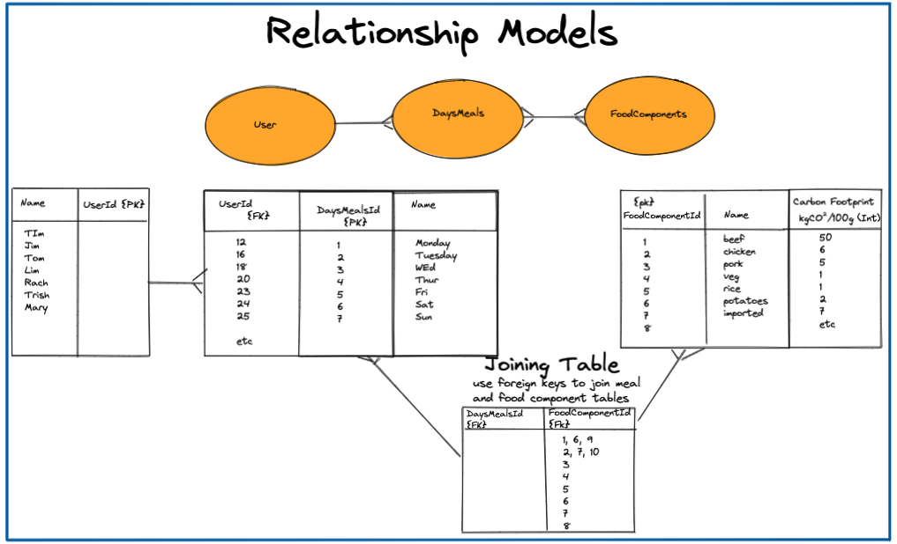
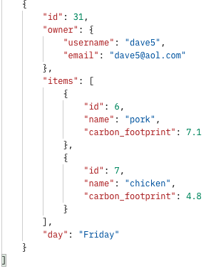

## Project Overview

ECOMO, a portmanteau of 'eco' and the spanish verb meaning 'I eat', is a website where users can input their daily food intake and monitor their carbon footprint attached to their dietary choices. The data for the carbon prices and users' meals is stored in a Django database while carbon calculations are done on frontend using JavaScript.

[Visit Site Here](https://ecomo-food-tracker.netlify.app/)

### Brief

<li>Build a relational database with Django</li>
<li>Have a 'one to many' relationship</li>
<li>Have a 'many to many' relationship</li>
<li>Connect it to a frontend built with React</li>
<li>Deploy the backend on Heroku</li>
<li>Deploy the frontend on Netlify</li>

### Technologies used

HTML5, SCSS, JavaScript (ES6), React and React extensions, Webpack, NPM, Babel, Postman, Python 3, Django, Heroku, Netlify, Git, GitHub, Excalidraw

#### Day 1

I'd come up with an idea that I was excited to build in th Food Carbon Tracker Website. I made some wireframes of the windows which would be included in my website however I was finding it difficult to conceptualise the relationships which would be ncessary in an SQL database. Therefore I drew diagrams of the one to many and many to many relationships in excalidraaw.

#### Day 2

I got the basic backend started with Django and pushed it to a newly created github repository and also deployed the project on Heroku. I then completed my secure registration, login and abilty for users to check their own credentials. I tested all of the enpoints using postman, ensuring that the jwt tokens were functioning correctly.

#### Day 3

I continued to work on the backend and added the abilty for users to upload their own meals by building the models and serializers for meal uploads and also carbon data uploads. In the views.py file for these features I ensured that only the admin user could upload the carbon data and alo only logged in users could post meals. ALthough progress was slow I felt I had gained a deeper understanding of the processes taking place on the backend.

#### Day 4

When doing more extensive testing of the database and API using Postman I realised I had an issue with the API call for getting meal data, which was returning all of the data from all of the users. I therefore also created an extra view that meant only the owner of a particular carbon footprint could access that data. This was a specfic piece of logic I had to write as it was not included under Django's inbuilt 'Generic Views'. Once this had been built I was retuning the correct data in postman.

#### Days 5 & 6

Although I had worked through the console errors the previous night whilst trying to get my front and back end talking I still had an issue persisiting into the next day. After having fresh eyes look at the project I realised that it was my error, and the reason I was receiving a 419 HTTP error was because I was trying to register an already existing user. Duh! I started building the form which users would use to input their meal data. The handlesubmit was buggy and took time to fix. When that was working I realised that the handlechange function on the dropdown also had a bug in which if a user erroneously selected a food it would store that as astring in the array of foods it was being pushed too. THis could lead to duplicates of foods or excess items being pushed in. I therefore spent a long time writing logic to get around this issue.

#### Days 7 & 8

I worked on styling on the Saunday night of a busy weekend. I added a navbar which showed different things to normal users and logged in users as well as applying th elogo and backgroud images to pages. On the final day I completed the logic to add up the carbon totals for a users meal and get it displayong on a new page. As the data was very nested it was difficult to access and work with. i inititiaally tried using a forEach loop and although I felt i was getting close to what I needed, from the conole logs I had put in at various points of the fucntion I hit a dead end. I threfore completely change my plan and used data.maps to complete the functions. I deployed my backend to Heroku and my frontend to Netlify.

